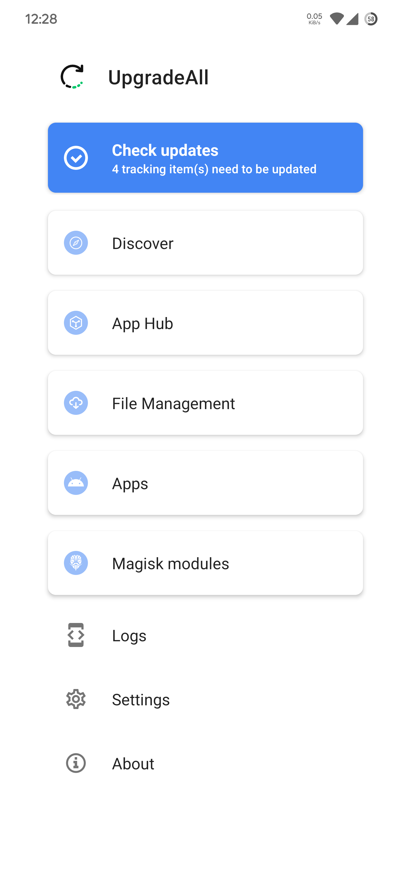
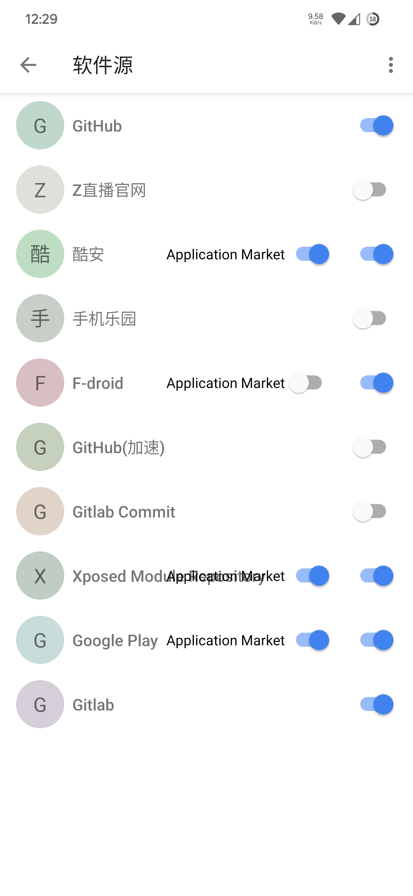
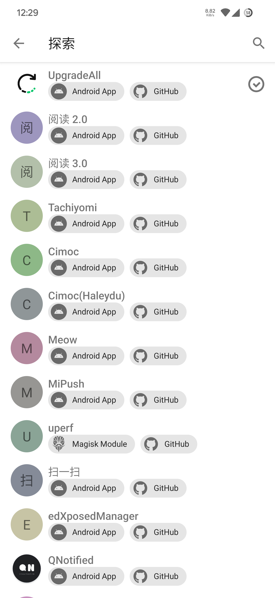
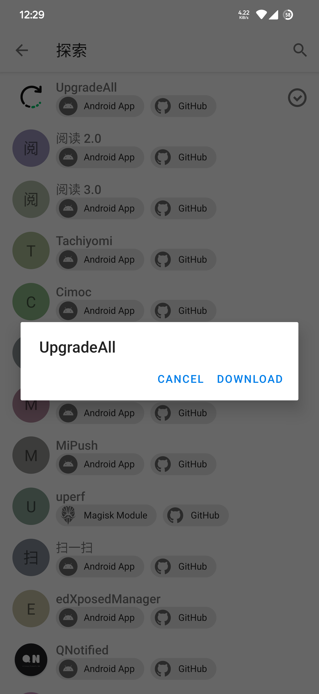
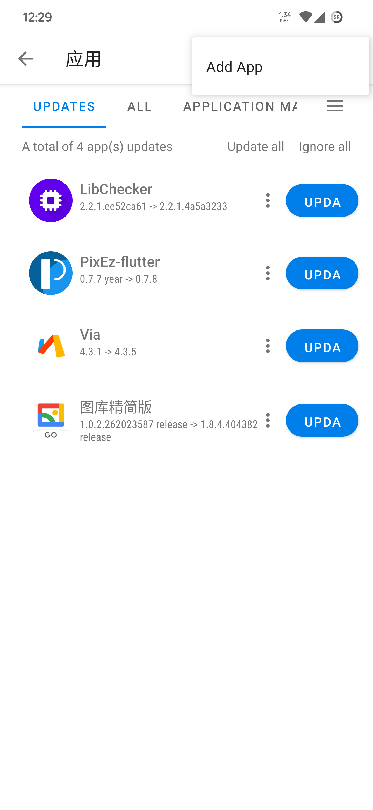
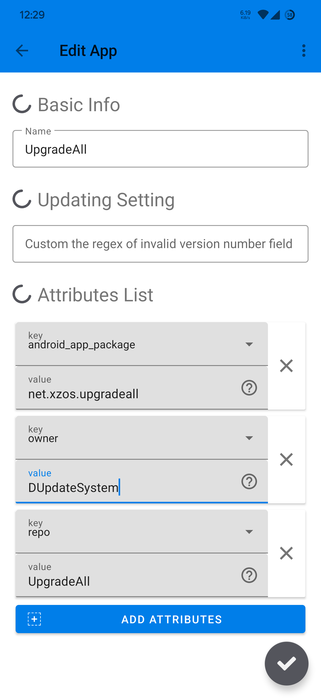
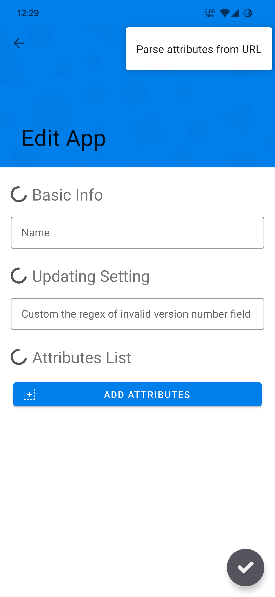
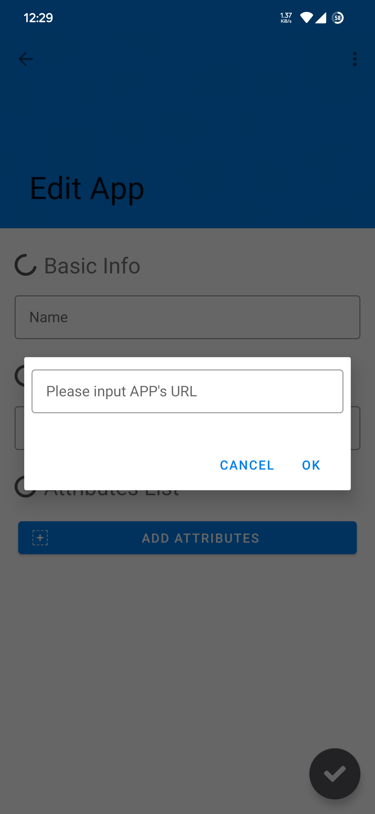

# 用户指南

## Introduction

Check for Android apps, Magisk modules and more!

UpgradeAll currently consists of a server-side and a client-side. The server side regularly crawls and caches. The client gets the updated data via api and displays it.

## How to add apps

### Add Apps

1. Open `App Hub` page from home page
2. Open `App Hub` you want to use
3. Open `Application Market` mode to detect updates for all installed apps

### Add apps via cloud-based repository

1. Open `Discover` page from home page
2. Find the apps you want and click on download (Coolapk and F-Droid already support app market mode, no need to download.)

### Add apps manually

::: warning
Please make sure that the corresponding `App Hub` has been added manually!
:::

1. Click `Apps` page top right corner `Add App`

Take `UpgradeAll` as example:  
`https://github.com/DUpdateSystem/UpgradeAll`

1. `Name` Fill in the name of the tracking app you want to set (feel free to do so)
2. Add attributes first(we need three attributes), then select `android_app_package` on key and fill in the value with the package name of `UpgradeAll`: `net.xzos.upgradeall`
3. Select `owner` and fill in the value with the repo owner `DUpdateSystem`
4. After that, Select `repo` and fill in the value with the project name `UpgradeAll`.

### Auto-add apps

1. `Edit App` page, top right corner, click `Parse attributes from URL`.
2. Fill in the full URL of the app, eg. `https://github.com/DUpdateSystem/UpgradeAll`.
3. Fill in the name of the tracking item at the top.
